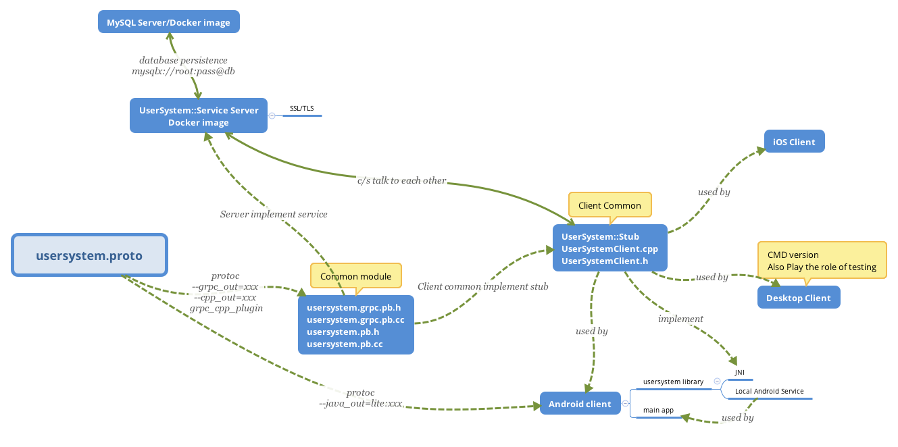
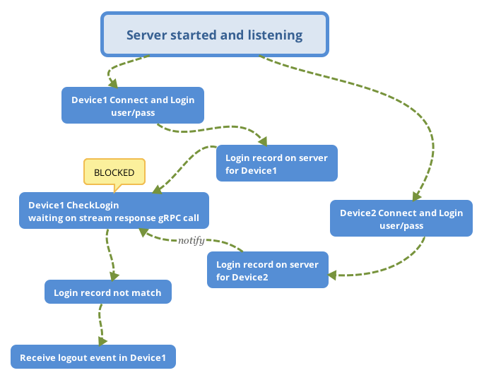

Cross platform user login system based on gRPC
======

A user register/login system based on gRPC C++, the client also implement in C++ and Android/iOS can share a same code base.

Just a simple demo application, including the following features

* User register
* User login
* User logout
* Client can received logout event if the same user login from a different new device, disable duplicated login
* Sensitive data is protected by `sslserver`/`sslchannel` only if client connect to server by hostname, fallback to `insecureserver`/`insecurechannel` if client connect to server by IP address which means the system is vulnerable 
* Use mysql and `mysqlx` protocol api for data persistence
* Currently, user password is stored via simple hash(`sha256`) algorithm, replace it with more security `bcrypt` password encoder

The following picture illustrate the design of this system from a developer perspective.


Quick Deployment Guide
------
For server deployment, just run
```bash
$ git clone https://github.com/WanghongLin/UserSystem
$ cd UserSystem
$ docker-compose up
```
The command above will setup two image, one for our usersystem app, and another is mysql db. Docker image for gRPC is a modification version of official [gRPC Dockerfile](https://github.com/grpc/grpc-docker-library/blob/master/1.21.0/cxx/Dockerfile) with `cmake` and `bazel` support.

After docker containers up, you can connect mysql db server from host mysql client with the following command

```bash
$ mysql -h localhost --protocol=TCP -P 33306 -uroot -pexample
```
Add the following volumes map to save mysql database to host after `docker-compose down`

```yaml
volumes:
    - /my/own/datadir/in/host:/var/lib/mysql
```

##### Deploy on low end machine
If your deploy machine have a small memory footprint with limited cpu cores, it usually happen on cloud service virtual machine, you will see this error

>[ERROR] [MY-012681] [InnoDB] mmap(137363456 bytes) failed; errno 12<br/>[ERROR] [MY-012956] [InnoDB] Cannot allocate memory for the buffer pool

Consider add command option `--innodb-buffer-pool-size=16M` to `docker-compose.yml` to use a small memory pool. Use the command `mysqld --verbose --help` to look up more options if you need more customizations on docker `mysqld`.

Also, consider use a prebuilt docker image from your desktop environment by `docker image save` and `scp` into your cloud service virtual machine, then use the prebuilt image by `docker image load` to reduce image build time.

Finally, provide a custom http timeout to run docker

```bash
$ sudo COMPOSE_HTTP_TIMEOUT=200 docker-compose up -d
```

Setup development environment and build
------
The testing and recommended gRPC version is `v1.23.x` and protoc version `3.8.0`

##### Prepare for macOS 
```bash
$ brew install openssl cmake
```

##### Prepare for Linux

In order to keep the same environment with docker, follow the [guide](https://github.com/grpc/grpc/blob/master/BUILDING.md) to build and install gPRC C++ for Linux, then install the requisite `libssl-dev` and `cmake`
```
$ apt install libssl-dev cmake
```

##### Build this project
```bash
$ git clone https://github.com/WanghongLin/UserSystem
$ cd UserSystem
$ ./build.sh
```

During the development cycle, use `gen.sh` to generate new files if you make changes to your proto, and use `bazel build //:server` to build with bazel.

Server setup
------
After build successfully, use the following command to run
```bash
$ DYLD_LIBRARY_PATH=mysqlcppconn_prebuilt/lib64:grpc_prebuilt/lib bazel-bin/server
```
Replace `bazel-bin` with `cmake-build` if you build with cmake and change `DYLD_LIBRARY_PATH` to `LD_LIBRARY_PATH` in Linux. 

The server app support `--enable-ssl` and `--db-url` options to secure the connection with ssl if client connect from hostname and let your specify database connection respectively. 

How to prevent multiple login
------
The following steps and picture illustrate how to disable multiple login for same user from different devices.

1. user login in `Device1` with user/pass/device_id_1
2. new login record on server `user/device_id_1`
3. user check login status in `Device1` and waiting
4. user login in `Device2` with user/pass/device_id_2
5. new login record on server `user/device_id_2`
6. login record does not match for `Device1`, notify user in `Device1` to logout



Android setup
------
In order to make `SerializeToByte` in C++ and `parseFrom(byte array)` in Java works, the protobuf format type should keep the same, both should use `protobuf` or `protobuf-lite`. For android, add protoc command option `--java_out=lite:${OUTPUT_DIR}` and `optimize_for = LITE_RUNTIME` declaration option to make both C++ and Java use the lite version.

Cross compile `grpc++` for android `arm64-v8a` from cmake, and use the following command to copy all static archives to android studio project.

```bash
$ find . -name "*.a" -exec cp {} /path/to/android/project/usersystem/libs/arm64-v8a/ \;
```

The order of prebuilt static libraries when adding to android project matters, `libgpr`/`libssl`/`libcrypto` should place
after `libgrpc++` and `libgrpc`, otherwise the linker will report strange symbols undefined error.

Build android project, and use the following command to generate necessary JNI binding

```bash
$ javah -o usersystem/src/main/cpp/usersystem_client.h \
    -classpath usersystem/build/tmp/kotlin-classes/debug \
    com.wanghong.grpc.usersystem.UserSystemNative
``` 

TODO
------
* add `armeabi-v7a` to support old non-64bits device
* use bcrypt password hashing algorithm to hash user password instead use the simple SHA256
* bazel build support for Android
* iOS and Desktop client

Reference
------
* [Generating a self-signed certificate using OpenSSL](https://www.ibm.com/support/knowledgecenter/en/SSMNED_5.0.0/com.ibm.apic.cmc.doc/task_apionprem_gernerate_self_signed_openSSL.html)
* [How to create a self-signed certificate with OpenSSL](https://stackoverflow.com/questions/10175812/how-to-create-a-self-signed-certificate-with-openssl)
* [gPRC Docker Library](https://github.com/grpc/grpc-docker-library)
* [low-memory-mysql](https://github.com/alexanderkoller/low-memory-mysql)
* [COMPOSE_HTTP_TIMEOUT](https://stackoverflow.com/questions/36488209/how-to-override-the-default-value-of-compose-http-timeout-with-docker-compose-co)
* [MySQL docker compose options](https://stackoverflow.com/questions/46004648/how-to-setup-mysql-with-utf-8-using-docker-compose)
* [MySQL docker hub](https://hub.docker.com/_/mysql)
* [jwt-cpp](https://github.com/Thalhammer/jwt-cpp)

##### MySQL Reference
* [MySQL Connector C++ in Github](https://github.com/mysql/mysql-connector-cpp)
* [Install MySQL Connector C++ in Ubuntu](https://stackoverflow.com/questions/51117349/cannot-install-mysql-connector-c-correctly-in-my-ubuntu)
* [MySQL Connector/C++ 8.0 Developer Guide](https://dev.mysql.com/doc/connector-cpp/8.0/en/)
* [MySQL Connector/C++ Documentation](https://dev.mysql.com/doc/dev/connector-cpp/8.0/)
* [Working with documents](https://docs.oracle.com/cd/E17952_01/x-devapi-userguide-en/devapi-users-working-with-documents.html)

##### Android Reference
* [Build gRPC C++ for Android](https://stackoverflow.com/questions/54052229/build-grpc-c-for-android-using-ndk-arm-linux-androideabi-clang-compiler)
* [Protobuf Java lite](https://github.com/protocolbuffers/protobuf/blob/master/java/lite.md)
* [Connect gRPC ssl server with IP address error](https://blog.csdn.net/u011627161/article/details/87936361)
* [gRPC server ssl with IP error](https://zhuanlan.zhihu.com/p/35507832)